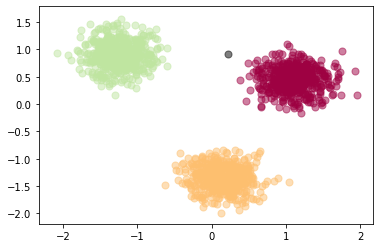
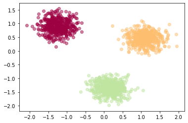
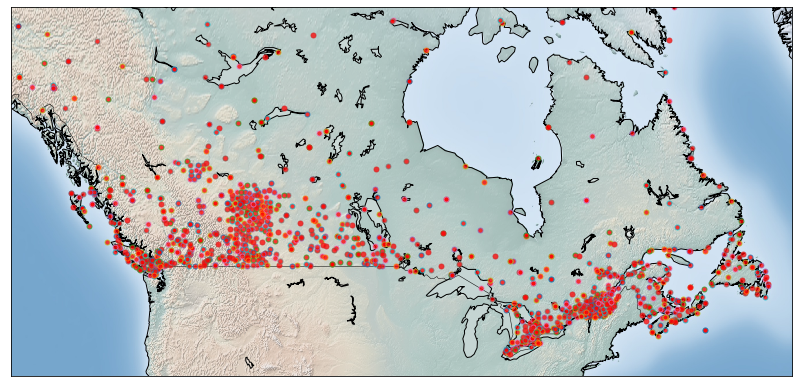
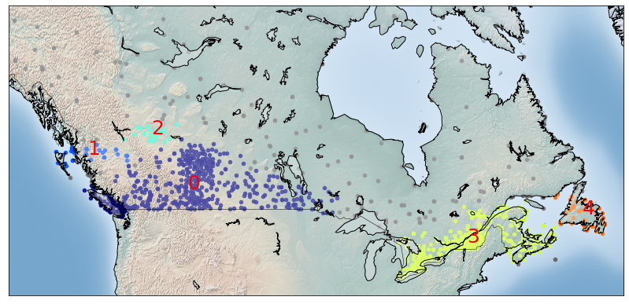
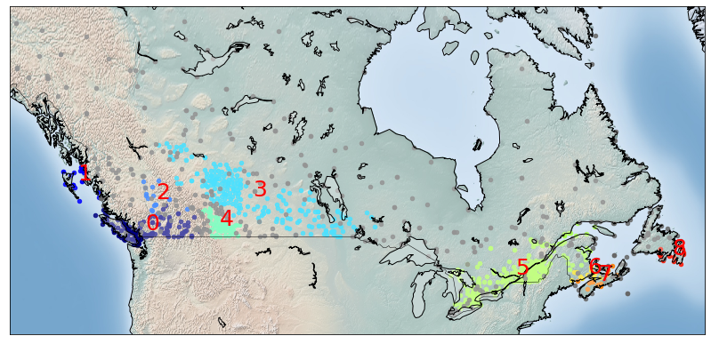

```python
# Para la visualización del mapa, se necesita un paquete basado en mapas.
# !conda install -c conda-forge  basemap==1.1.0  matplotlib==2.2.2  -y
```


```python
import numpy as np 
from sklearn.cluster import DBSCAN 
from sklearn.datasets.samples_generator import make_blobs 
from sklearn.preprocessing import StandardScaler 
import matplotlib.pyplot as plt 
%matplotlib inline
```


### Generación de datos
La siguiente función genera los puntos de datos y necesita estas entradas:
<ul>
    <li> <b>centroidLocation</b>: Coordina los centroides que generarán los datos aleatorios. </li>
    <ul> <li> Example: input: [[4,3], [2,-1], [-1,4]] </li> </ul>
    <li> <b>numSamples</b>: El número de datos que queremos generar, dividir sobre los centroides (centroides definidos en centroidLocation) </li>
    <ul> <li> Ejemplo: 1500 </li> </ul>
    <li> <b>clusterDeviation</b>: La desviación standard entre clusters. Mientras más grande el número, más lejos la distancia. </li>
    <ul> <li> Ejemplo: 0.5 </li> </ul>
</ul>


```python
def createDataPoints(centroidLocation, numSamples, clusterDeviation):
    # Crear datos aleatorios y almacenar en la matriz X y el vector y.
    X, y = make_blobs(n_samples=numSamples, centers=centroidLocation, 
                                cluster_std=clusterDeviation)
    
    # Estandarizar características eliminando el promedio y la unidad de escala
    X = StandardScaler().fit_transform(X)
    return X, y
```

Usar <b>createDataPoints</b> con <b>3 datos de entrada</b> y guardar la salida en variable <b>X</b> e <b>y</b>.


```python
X, y = createDataPoints([[4,3], [2,-1], [-1,4]] , 1500, 0.5)
```

### Modelado
DBSCAN significa Density-based Spatial Clustering of Applications with Noise (Clustering espacial basado en densidad de aplicaciones con ruido). Esta técnica es una de las más comunes de algoritmos de clustering, que funciona en base a la densidad del objeto.
DBSCAN trabaja en la idea de que si un punto en particular pertenece a un cluster, debería estar cerca de un montón de otros puntos en ese cluster.

Funciona en base a 2 parámetros: Radio y Puntos Mínimos.  
__epsilon__ determina un radio especificado que, si incluye suficientes puntos dentro de él, lo llamamos de "área densa".
__minimumSamples__ determina el número mínimo de puntos de datos que queremos en un neighborhood (vecindario) para definir un cluster.


```python
epsilon = 0.3
minimumSamples = 7
db = DBSCAN(eps=epsilon, min_samples=minimumSamples).fit(X)
labels = db.labels_
labels
```


    array([0, 1, 2, ..., 2, 0, 1])


### Distinguir Valores Atípicos
Reemplacemos todos los elementos con 'True' en core_samples_mask que estan en el cluster, 'False' si los puntos son valores atípicos (outliers).


```python
# Primer, crear un vector de valores booleanos (valores binarios (verdadero/falso)) usando las etiquetas de la variable db.
core_samples_mask = np.zeros_like(db.labels_, dtype=bool)
core_samples_mask[db.core_sample_indices_] = True
core_samples_mask
```


    array([ True,  True,  True, ...,  True,  True,  True])


```python
# Número de clusters en etiquetas, ignorando el ruido en caso de estar presente.
n_clusters_ = len(set(labels)) - (1 if -1 in labels else 0)
n_clusters_
```


    3


```python
# Eliminar la repetición en las etiquetas transformándolas en un conjunto.
unique_labels = set(labels)
unique_labels
```


    {-1, 0, 1, 2}


### Visualización de Datos


```python
# Crear colores para los clusters.
colors = plt.cm.Spectral(np.linspace(0, 1, len(unique_labels)))
colors
```


    array([[0.61960784, 0.00392157, 0.25882353, 1.        ],
           [0.99346405, 0.74771242, 0.43529412, 1.        ],
           [0.74771242, 0.89803922, 0.62745098, 1.        ],
           [0.36862745, 0.30980392, 0.63529412, 1.        ]])


```python
# Dibujar los puntos con colores
for k, col in zip(unique_labels, colors):
    if k == -1:
        # El color negro se utilizará para señalar ruido en los datos.
        col = 'k'

    class_member_mask = (labels == k)

    # Dibujoar los datos que estan agrupados (clusterizados)
    xy = X[class_member_mask & core_samples_mask]
    plt.scatter(xy[:, 0], xy[:, 1],s=50, c=col, marker=u'o', alpha=0.5)

    # Dibujar los valores atípicos
    xy = X[class_member_mask & ~core_samples_mask]
    plt.scatter(xy[:, 0], xy[:, 1],s=50, c=col, marker=u'o', alpha=0.5)
```

    'c' argument looks like a single numeric RGB or RGBA sequence, which should be avoided as value-mapping will have precedence in case its length matches with 'x' & 'y'.  Please use a 2-D array with a single row if you really want to specify the same RGB or RGBA value for all points.
    'c' argument looks like a single numeric RGB or RGBA sequence, which should be avoided as value-mapping will have precedence in case its length matches with 'x' & 'y'.  Please use a 2-D array with a single row if you really want to specify the same RGB or RGBA value for all points.
    'c' argument looks like a single numeric RGB or RGBA sequence, which should be avoided as value-mapping will have precedence in case its length matches with 'x' & 'y'.  Please use a 2-D array with a single row if you really want to specify the same RGB or RGBA value for all points.
    'c' argument looks like a single numeric RGB or RGBA sequence, which should be avoided as value-mapping will have precedence in case its length matches with 'x' & 'y'.  Please use a 2-D array with a single row if you really want to specify the same RGB or RGBA value for all points.
    'c' argument looks like a single numeric RGB or RGBA sequence, which should be avoided as value-mapping will have precedence in case its length matches with 'x' & 'y'.  Please use a 2-D array with a single row if you really want to specify the same RGB or RGBA value for all points.
    'c' argument looks like a single numeric RGB or RGBA sequence, which should be avoided as value-mapping will have precedence in case its length matches with 'x' & 'y'.  Please use a 2-D array with a single row if you really want to specify the same RGB or RGBA value for all points.





Para entender mejor las diferencias entre el clustering basado en densidad y el basado en partición, intentaremos agrupar el conjunto de datos anterior en 3 clusters usando k-Medias.
No se genera datos de nuevo, se utiliza el mismo de antes.


```python
from sklearn.cluster import KMeans 
k = 3
k_means3 = KMeans(init = "k-means++", n_clusters = k, n_init = 12)
k_means3.fit(X)
fig = plt.figure(figsize=(6, 4))
ax = fig.add_subplot(1, 1, 1)
for k, col in zip(range(k), colors):
    my_members = (k_means3.labels_ == k)
    plt.scatter(X[my_members, 0], X[my_members, 1],  c=col, marker=u'o', alpha=0.5)
plt.show()


```

    'c' argument looks like a single numeric RGB or RGBA sequence, which should be avoided as value-mapping will have precedence in case its length matches with 'x' & 'y'.  Please use a 2-D array with a single row if you really want to specify the same RGB or RGBA value for all points.
    'c' argument looks like a single numeric RGB or RGBA sequence, which should be avoided as value-mapping will have precedence in case its length matches with 'x' & 'y'.  Please use a 2-D array with a single row if you really want to specify the same RGB or RGBA value for all points.
    'c' argument looks like a single numeric RGB or RGBA sequence, which should be avoided as value-mapping will have precedence in case its length matches with 'x' & 'y'.  Please use a 2-D array with a single row if you really want to specify the same RGB or RGBA value for all points.





from sklearn.cluster import KMeans 
k = 3
k_means3 = KMeans(init = "k-means++", n_clusters = k, n_init = 12)
k_means3.fit(X)
fig = plt.figure(figsize=(6, 4))
ax = fig.add_subplot(1, 1, 1)
for k, col in zip(range(k), colors):
    my_members = (k_means3.labels_ == k)
    plt.scatter(X[my_members, 0], X[my_members, 1],  c=col, marker=u'o', alpha=0.5)
plt.show()


-->


<h1 align=center> Weather Station Clustering usando DBSCAN y scikit-learn </h1>
<hr>

DBSCAN es especialmente eficaz para tareas como la identificación de clases en un contexto espacial. El atributo maravilloso del algoritmo DBSCAN es que puede encontrar cualquier forma arbitraria de cluster sin verse afectado por el ruido. Por ejemplo, este mapa muestra la ubicación de las estaciones meteorológicas en Canadá.
DBSCAN puede ser usado aquí para encontrar el grupo de estaciones, que muestran las mismas condiciones climáticas. Como puede ver,no sólo encuentra diferentes clusteres en forma arbitraria, sino que puede encontrar la parte más densa de las muestras centradas en datos ignorando áreas menos densas o ruidos.

comencemos jugando con los datos. Estaremos trabajando en función de la siguiente secuencia: </font>
- Cargar datos
- Revisar datos
- Limpiar datos
- Seleccionar datos
- Clustering

### Acerca del set de datos

		
<h4 align = "center">
Environment Canada    
Monthly Values for July - 2015	
</h4>
<html>
<head>
</head>
<body>

<table>
  <tr>
    <th>Name in the table</th>
    <th>Meaning</th>
  </tr>
  <tr>
    <td><font color = "green"><strong>Stn_Name</font></td>
    <td><font color = "green"><strong>Station Name</font</td>
  </tr>
  <tr>
    <td><font color = "green"><strong>Lat</font></td>
    <td><font color = "green"><strong>Latitude (North+, degrees)</font></td>
  </tr>
  <tr>
    <td><font color = "green"><strong>Long</font></td>
    <td><font color = "green"><strong>Longitude (West - , degrees)</font></td>
  </tr>
  <tr>
    <td>Prov</td>
    <td>Province</td>
  </tr>
  <tr>
    <td>Tm</td>
    <td>Mean Temperature (°C)</td>
  </tr>
  <tr>
    <td>DwTm</td>
    <td>Days without Valid Mean Temperature</td>
  </tr>
  <tr>
    <td>D</td>
    <td>Mean Temperature difference from Normal (1981-2010) (°C)</td>
  </tr>
  <tr>
    <td><font color = "black">Tx</font></td>
    <td><font color = "black">Highest Monthly Maximum Temperature (°C)</font></td>
  </tr>
  <tr>
    <td>DwTx</td>
    <td>Days without Valid Maximum Temperature</td>
  </tr>
  <tr>
    <td><font color = "black">Tn</font></td>
    <td><font color = "black">Lowest Monthly Minimum Temperature (°C)</font></td>
  </tr>
  <tr>
    <td>DwTn</td>
    <td>Days without Valid Minimum Temperature</td>
  </tr>
  <tr>
    <td>S</td>
    <td>Snowfall (cm)</td>
  </tr>
  <tr>
    <td>DwS</td>
    <td>Days without Valid Snowfall</td>
  </tr>
  <tr>
    <td>S%N</td>
    <td>Percent of Normal (1981-2010) Snowfall</td>
  </tr>
  <tr>
    <td><font color = "green"><strong>P</font></td>
    <td><font color = "green"><strong>Total Precipitation (mm)</font></td>
  </tr>
  <tr>
    <td>DwP</td>
    <td>Days without Valid Precipitation</td>
  </tr>
  <tr>
    <td>P%N</td>
    <td>Percent of Normal (1981-2010) Precipitation</td>
  </tr>
  <tr>
    <td>S_G</td>
    <td>Snow on the ground at the end of the month (cm)</td>
  </tr>
  <tr>
    <td>Pd</td>
    <td>Number of days with Precipitation 1.0 mm or more</td>
  </tr>
  <tr>
    <td>BS</td>
    <td>Bright Sunshine (hours)</td>
  </tr>
  <tr>
    <td>DwBS</td>
    <td>Days without Valid Bright Sunshine</td>
  </tr>
  <tr>
    <td>BS%</td>
    <td>Percent of Normal (1981-2010) Bright Sunshine</td>
  </tr>
  <tr>
    <td>HDD</td>
    <td>Degree Days below 18 °C</td>
  </tr>
  <tr>
    <td>CDD</td>
    <td>Degree Days above 18 °C</td>
  </tr>
  <tr>
    <td>Stn_No</td>
    <td>Climate station identifier (first 3 digits indicate   drainage basin, last 4 characters are for sorting alphabetically).</td>
  </tr>
  <tr>
    <td>NA</td>
    <td>Not Available</td>
  </tr>


</table>

</body>
</html>

```python
!wget -O weather-stations20140101-20141231.csv https://s3-api.us-geo.objectstorage.softlayer.net/cf-courses-data/CognitiveClass/ML0101ENv3/labs/weather-stations20140101-20141231.csv
```

    --2020-01-22 02:21:04--  https://s3-api.us-geo.objectstorage.softlayer.net/cf-courses-data/CognitiveClass/ML0101ENv3/labs/weather-stations20140101-20141231.csv
    Resolving s3-api.us-geo.objectstorage.softlayer.net (s3-api.us-geo.objectstorage.softlayer.net)... 67.228.254.196
    Connecting to s3-api.us-geo.objectstorage.softlayer.net (s3-api.us-geo.objectstorage.softlayer.net)|67.228.254.196|:443... connected.
    HTTP request sent, awaiting response... 200 OK
    Length: 129821 (127K) [text/csv]
    Saving to: ‘weather-stations20140101-20141231.csv’
    
    weather-stations201 100%[===================>] 126.78K  --.-KB/s    in 0.08s   
    
    2020-01-22 02:21:04 (1.46 MB/s) - ‘weather-stations20140101-20141231.csv’ saved [129821/129821]
    


### 2- Cargar el set de datos
Importaremos el .csv, luego crearemos las columnas para el año, mes y el dia.


```python
import csv
import pandas as pd
import numpy as np

filename='weather-stations20140101-20141231.csv'

#Leer csv
pdf = pd.read_csv(filename)
pdf.head(5)
```


<div>
<table border="1" class="dataframe">
  <thead>
    <tr style="text-align: right;">
      <th></th>
      <th>Stn_Name</th>
      <th>Lat</th>
      <th>Long</th>
      <th>Prov</th>
      <th>Tm</th>
      <th>DwTm</th>
      <th>D</th>
      <th>Tx</th>
      <th>DwTx</th>
      <th>Tn</th>
      <th>...</th>
      <th>DwP</th>
      <th>P%N</th>
      <th>S_G</th>
      <th>Pd</th>
      <th>BS</th>
      <th>DwBS</th>
      <th>BS%</th>
      <th>HDD</th>
      <th>CDD</th>
      <th>Stn_No</th>
    </tr>
  </thead>
  <tbody>
    <tr>
      <th>0</th>
      <td>CHEMAINUS</td>
      <td>48.935</td>
      <td>-123.742</td>
      <td>BC</td>
      <td>8.2</td>
      <td>0.0</td>
      <td>NaN</td>
      <td>13.5</td>
      <td>0.0</td>
      <td>1.0</td>
      <td>...</td>
      <td>0.0</td>
      <td>NaN</td>
      <td>0.0</td>
      <td>12.0</td>
      <td>NaN</td>
      <td>NaN</td>
      <td>NaN</td>
      <td>273.3</td>
      <td>0.0</td>
      <td>1011500</td>
    </tr>
    <tr>
      <th>1</th>
      <td>COWICHAN LAKE FORESTRY</td>
      <td>48.824</td>
      <td>-124.133</td>
      <td>BC</td>
      <td>7.0</td>
      <td>0.0</td>
      <td>3.0</td>
      <td>15.0</td>
      <td>0.0</td>
      <td>-3.0</td>
      <td>...</td>
      <td>0.0</td>
      <td>104.0</td>
      <td>0.0</td>
      <td>12.0</td>
      <td>NaN</td>
      <td>NaN</td>
      <td>NaN</td>
      <td>307.0</td>
      <td>0.0</td>
      <td>1012040</td>
    </tr>
    <tr>
      <th>2</th>
      <td>LAKE COWICHAN</td>
      <td>48.829</td>
      <td>-124.052</td>
      <td>BC</td>
      <td>6.8</td>
      <td>13.0</td>
      <td>2.8</td>
      <td>16.0</td>
      <td>9.0</td>
      <td>-2.5</td>
      <td>...</td>
      <td>9.0</td>
      <td>NaN</td>
      <td>NaN</td>
      <td>11.0</td>
      <td>NaN</td>
      <td>NaN</td>
      <td>NaN</td>
      <td>168.1</td>
      <td>0.0</td>
      <td>1012055</td>
    </tr>
    <tr>
      <th>3</th>
      <td>DISCOVERY ISLAND</td>
      <td>48.425</td>
      <td>-123.226</td>
      <td>BC</td>
      <td>NaN</td>
      <td>NaN</td>
      <td>NaN</td>
      <td>12.5</td>
      <td>0.0</td>
      <td>NaN</td>
      <td>...</td>
      <td>NaN</td>
      <td>NaN</td>
      <td>NaN</td>
      <td>NaN</td>
      <td>NaN</td>
      <td>NaN</td>
      <td>NaN</td>
      <td>NaN</td>
      <td>NaN</td>
      <td>1012475</td>
    </tr>
    <tr>
      <th>4</th>
      <td>DUNCAN KELVIN CREEK</td>
      <td>48.735</td>
      <td>-123.728</td>
      <td>BC</td>
      <td>7.7</td>
      <td>2.0</td>
      <td>3.4</td>
      <td>14.5</td>
      <td>2.0</td>
      <td>-1.0</td>
      <td>...</td>
      <td>2.0</td>
      <td>NaN</td>
      <td>NaN</td>
      <td>11.0</td>
      <td>NaN</td>
      <td>NaN</td>
      <td>NaN</td>
      <td>267.7</td>
      <td>0.0</td>
      <td>1012573</td>
    </tr>
  </tbody>
</table>
<p>5 rows × 25 columns</p>
</div>


### 3-Limpieza
Saquemos las filas que no tienen valor en el campo __Tm__.


```python
pdf = pdf[pd.notnull(pdf["Tm"])]
pdf = pdf.reset_index(drop=True)
pdf.head(5)
```


<div>
<table border="1" class="dataframe">
  <thead>
    <tr style="text-align: right;">
      <th></th>
      <th>Stn_Name</th>
      <th>Lat</th>
      <th>Long</th>
      <th>Prov</th>
      <th>Tm</th>
      <th>DwTm</th>
      <th>D</th>
      <th>Tx</th>
      <th>DwTx</th>
      <th>Tn</th>
      <th>...</th>
      <th>DwP</th>
      <th>P%N</th>
      <th>S_G</th>
      <th>Pd</th>
      <th>BS</th>
      <th>DwBS</th>
      <th>BS%</th>
      <th>HDD</th>
      <th>CDD</th>
      <th>Stn_No</th>
    </tr>
  </thead>
  <tbody>
    <tr>
      <th>0</th>
      <td>CHEMAINUS</td>
      <td>48.935</td>
      <td>-123.742</td>
      <td>BC</td>
      <td>8.2</td>
      <td>0.0</td>
      <td>NaN</td>
      <td>13.5</td>
      <td>0.0</td>
      <td>1.0</td>
      <td>...</td>
      <td>0.0</td>
      <td>NaN</td>
      <td>0.0</td>
      <td>12.0</td>
      <td>NaN</td>
      <td>NaN</td>
      <td>NaN</td>
      <td>273.3</td>
      <td>0.0</td>
      <td>1011500</td>
    </tr>
    <tr>
      <th>1</th>
      <td>COWICHAN LAKE FORESTRY</td>
      <td>48.824</td>
      <td>-124.133</td>
      <td>BC</td>
      <td>7.0</td>
      <td>0.0</td>
      <td>3.0</td>
      <td>15.0</td>
      <td>0.0</td>
      <td>-3.0</td>
      <td>...</td>
      <td>0.0</td>
      <td>104.0</td>
      <td>0.0</td>
      <td>12.0</td>
      <td>NaN</td>
      <td>NaN</td>
      <td>NaN</td>
      <td>307.0</td>
      <td>0.0</td>
      <td>1012040</td>
    </tr>
    <tr>
      <th>2</th>
      <td>LAKE COWICHAN</td>
      <td>48.829</td>
      <td>-124.052</td>
      <td>BC</td>
      <td>6.8</td>
      <td>13.0</td>
      <td>2.8</td>
      <td>16.0</td>
      <td>9.0</td>
      <td>-2.5</td>
      <td>...</td>
      <td>9.0</td>
      <td>NaN</td>
      <td>NaN</td>
      <td>11.0</td>
      <td>NaN</td>
      <td>NaN</td>
      <td>NaN</td>
      <td>168.1</td>
      <td>0.0</td>
      <td>1012055</td>
    </tr>
    <tr>
      <th>3</th>
      <td>DUNCAN KELVIN CREEK</td>
      <td>48.735</td>
      <td>-123.728</td>
      <td>BC</td>
      <td>7.7</td>
      <td>2.0</td>
      <td>3.4</td>
      <td>14.5</td>
      <td>2.0</td>
      <td>-1.0</td>
      <td>...</td>
      <td>2.0</td>
      <td>NaN</td>
      <td>NaN</td>
      <td>11.0</td>
      <td>NaN</td>
      <td>NaN</td>
      <td>NaN</td>
      <td>267.7</td>
      <td>0.0</td>
      <td>1012573</td>
    </tr>
    <tr>
      <th>4</th>
      <td>ESQUIMALT HARBOUR</td>
      <td>48.432</td>
      <td>-123.439</td>
      <td>BC</td>
      <td>8.8</td>
      <td>0.0</td>
      <td>NaN</td>
      <td>13.1</td>
      <td>0.0</td>
      <td>1.9</td>
      <td>...</td>
      <td>8.0</td>
      <td>NaN</td>
      <td>NaN</td>
      <td>12.0</td>
      <td>NaN</td>
      <td>NaN</td>
      <td>NaN</td>
      <td>258.6</td>
      <td>0.0</td>
      <td>1012710</td>
    </tr>
  </tbody>
</table>
<p>5 rows × 25 columns</p>
</div>


### 4-Visualización
Visualización de estaciones usando el package basemap. El toolkit basemap matplotlib es una librería para dibujo de mapas en 2D en Python. Basemap no dibuja por sí mismo, sino que facilita la transformación de las coordenadas a proyecciones de mapas. 

Favor notar que el tamaño de cada punto de datos representa el promedio máximo de temperatura para cada estación del año. 


```python
from mpl_toolkits.basemap import Basemap
import matplotlib.pyplot as plt
from pylab import rcParams
%matplotlib inline
rcParams['figure.figsize'] = (14,10)

llon=-140
ulon=-50
llat=40
ulat=65

pdf = pdf[(pdf['Long'] > llon) & (pdf['Long'] < ulon) & (pdf['Lat'] > llat) &(pdf['Lat'] < ulat)]

my_map = Basemap(projection='merc',
            resolution = 'l', area_thresh = 1000.0,
            llcrnrlon=llon, llcrnrlat=llat, #min longitude (llcrnrlon) and latitude (llcrnrlat)
            urcrnrlon=ulon, urcrnrlat=ulat) #max longitude (urcrnrlon) and latitude (urcrnrlat)

my_map.drawcoastlines()
my_map.drawcountries()
# my_map.drawmapboundary()
my_map.fillcontinents(color = 'white', alpha = 0.3)
my_map.shadedrelief()

# Recoleccion de los datos de las estaciones      

xs,ys = my_map(np.asarray(pdf.Long), np.asarray(pdf.Lat))
pdf['xm']= xs.tolist()
pdf['ym'] =ys.tolist()

#Visualización1
for index,row in pdf.iterrows():
#   x,y = my_map(row.Long, row.Lat)
   my_map.plot(row.xm, row.ym,markerfacecolor =([1,0,0]),  marker='o', markersize= 5, alpha = 0.75)
#plt.text(x,y,stn)
plt.show()


```





### 5- Clustering de las estaciones basado en su ubicación. Ej. Lat & Lon

__DBSCAN__ (parte de la librería sklearn) ejecuta el clustering desde un vector o una matriz de distancia. En este caso, se pasa el arregloNumpy array Clus_dataSet para encontrar ejemplos de alta densidad y expandir clusters a partir de ellos. 


```python
from sklearn.cluster import DBSCAN
import sklearn.utils
from sklearn.preprocessing import StandardScaler
sklearn.utils.check_random_state(1000)
Clus_dataSet = pdf[['xm','ym']]
Clus_dataSet = np.nan_to_num(Clus_dataSet)
Clus_dataSet = StandardScaler().fit_transform(Clus_dataSet)

# Calcular con DBSCAN
db = DBSCAN(eps=0.15, min_samples=10).fit(Clus_dataSet)
core_samples_mask = np.zeros_like(db.labels_, dtype=bool)
core_samples_mask[db.core_sample_indices_] = True
labels = db.labels_
pdf["Clus_Db"]=labels

realClusterNum=len(set(labels)) - (1 if -1 in labels else 0)
clusterNum = len(set(labels)) 


# Muestra de clusters
pdf[["Stn_Name","Tx","Tm","Clus_Db"]].head(5)
```


<div>
<table border="1" class="dataframe">
  <thead>
    <tr style="text-align: right;">
      <th></th>
      <th>Stn_Name</th>
      <th>Tx</th>
      <th>Tm</th>
      <th>Clus_Db</th>
    </tr>
  </thead>
  <tbody>
    <tr>
      <th>0</th>
      <td>CHEMAINUS</td>
      <td>13.5</td>
      <td>8.2</td>
      <td>0</td>
    </tr>
    <tr>
      <th>1</th>
      <td>COWICHAN LAKE FORESTRY</td>
      <td>15.0</td>
      <td>7.0</td>
      <td>0</td>
    </tr>
    <tr>
      <th>2</th>
      <td>LAKE COWICHAN</td>
      <td>16.0</td>
      <td>6.8</td>
      <td>0</td>
    </tr>
    <tr>
      <th>3</th>
      <td>DUNCAN KELVIN CREEK</td>
      <td>14.5</td>
      <td>7.7</td>
      <td>0</td>
    </tr>
    <tr>
      <th>4</th>
      <td>ESQUIMALT HARBOUR</td>
      <td>13.1</td>
      <td>8.8</td>
      <td>0</td>
    </tr>
  </tbody>
</table>
</div>


Con los valores atípicos, la etiqueta del cluster es -1


```python
set(labels)
```


    {-1, 0, 1, 2, 3, 4}


### 6- Visualización de clusters basados en ubicación
Ahora, se visualiza los clusters usando basemap:


```python
from mpl_toolkits.basemap import Basemap
import matplotlib.pyplot as plt
from pylab import rcParams
%matplotlib inline
rcParams['figure.figsize'] = (14,10)

my_map = Basemap(projection='merc',
            resolution = 'l', area_thresh = 1000.0,
            llcrnrlon=llon, llcrnrlat=llat, #min longitude (llcrnrlon) and latitude (llcrnrlat)
            urcrnrlon=ulon, urcrnrlat=ulat) #max longitude (urcrnrlon) and latitude (urcrnrlat)

my_map.drawcoastlines()
my_map.drawcountries()
#my_map.drawmapboundary()
my_map.fillcontinents(color = 'white', alpha = 0.3)
my_map.shadedrelief()

# Para crear un mapa de colores
colors = plt.get_cmap('jet')(np.linspace(0.0, 1.0, clusterNum))


#Visualización
for clust_number in set(labels):
    c=(([0.4,0.4,0.4]) if clust_number == -1 else colors[np.int(clust_number)])
    clust_set = pdf[pdf.Clus_Db == clust_number]                    
    my_map.scatter(clust_set.xm, clust_set.ym, color =c,  marker='o', s= 20, alpha = 0.85)
    if clust_number != -1:
        cenx=np.mean(clust_set.xm) 
        ceny=np.mean(clust_set.ym) 
        plt.text(cenx,ceny,str(clust_number), fontsize=25, color='red',)
        print ("Cluster "+str(clust_number)+', Avg Temp: '+ str(np.mean(clust_set.Tm)))
```


    Cluster 0, Avg Temp: -5.538747553816046
    Cluster 1, Avg Temp: 1.9526315789473685
    Cluster 2, Avg Temp: -9.195652173913045
    Cluster 3, Avg Temp: -15.300833333333333
    Cluster 4, Avg Temp: -7.769047619047619





### 7- Clustering de estaciones basado en su ubicacion, temperatura promedio, máxima y mínima
En esta sección, volvemos a ejecutar DBSCAN, pero esta vez, en un dataset de 5-dimensiones:


```python
from sklearn.cluster import DBSCAN
import sklearn.utils
from sklearn.preprocessing import StandardScaler
sklearn.utils.check_random_state(1000)
Clus_dataSet = pdf[['xm','ym','Tx','Tm','Tn']]
Clus_dataSet = np.nan_to_num(Clus_dataSet)
Clus_dataSet = StandardScaler().fit_transform(Clus_dataSet)

# Computar DBSCAN
db = DBSCAN(eps=0.3, min_samples=10).fit(Clus_dataSet)
core_samples_mask = np.zeros_like(db.labels_, dtype=bool)
core_samples_mask[db.core_sample_indices_] = True
labels = db.labels_
pdf["Clus_Db"]=labels

realClusterNum=len(set(labels)) - (1 if -1 in labels else 0)
clusterNum = len(set(labels)) 


# Una muestra de clusters
pdf[["Stn_Name","Tx","Tm","Clus_Db"]].head(5)
```


<div>
<table border="1" class="dataframe">
  <thead>
    <tr style="text-align: right;">
      <th></th>
      <th>Stn_Name</th>
      <th>Tx</th>
      <th>Tm</th>
      <th>Clus_Db</th>
    </tr>
  </thead>
  <tbody>
    <tr>
      <th>0</th>
      <td>CHEMAINUS</td>
      <td>13.5</td>
      <td>8.2</td>
      <td>0</td>
    </tr>
    <tr>
      <th>1</th>
      <td>COWICHAN LAKE FORESTRY</td>
      <td>15.0</td>
      <td>7.0</td>
      <td>0</td>
    </tr>
    <tr>
      <th>2</th>
      <td>LAKE COWICHAN</td>
      <td>16.0</td>
      <td>6.8</td>
      <td>0</td>
    </tr>
    <tr>
      <th>3</th>
      <td>DUNCAN KELVIN CREEK</td>
      <td>14.5</td>
      <td>7.7</td>
      <td>0</td>
    </tr>
    <tr>
      <th>4</th>
      <td>ESQUIMALT HARBOUR</td>
      <td>13.1</td>
      <td>8.8</td>
      <td>0</td>
    </tr>
  </tbody>
</table>
</div>


### 8- Visualización de clusters basados en ubicación y temperatura


```python
from mpl_toolkits.basemap import Basemap
import matplotlib.pyplot as plt
from pylab import rcParams
%matplotlib inline
rcParams['figure.figsize'] = (14,10)

my_map = Basemap(projection='merc',
            resolution = 'l', area_thresh = 1000.0,
            llcrnrlon=llon, llcrnrlat=llat, #min longitude (llcrnrlon) and latitude (llcrnrlat)
            urcrnrlon=ulon, urcrnrlat=ulat) #max longitude (urcrnrlon) and latitude (urcrnrlat)

my_map.drawcoastlines()
my_map.drawcountries()
#my_map.drawmapboundary()
my_map.fillcontinents(color = 'white', alpha = 0.3)
my_map.shadedrelief()

# Para crear un mapa de color
colors = plt.get_cmap('jet')(np.linspace(0.0, 1.0, clusterNum))


#Visualización1
for clust_number in set(labels):
    c=(([0.4,0.4,0.4]) if clust_number == -1 else colors[np.int(clust_number)])
    clust_set = pdf[pdf.Clus_Db == clust_number]                    
    my_map.scatter(clust_set.xm, clust_set.ym, color =c,  marker='o', s= 20, alpha = 0.85)
    if clust_number != -1:
        cenx=np.mean(clust_set.xm) 
        ceny=np.mean(clust_set.ym) 
        plt.text(cenx,ceny,str(clust_number), fontsize=25, color='red',)
        print ("Cluster "+str(clust_number)+', Avg Temp: '+ str(np.mean(clust_set.Tm)))
```


    Cluster 0, Avg Temp: 6.221192052980132
    Cluster 1, Avg Temp: 6.790000000000001
    Cluster 2, Avg Temp: -0.49411764705882344
    Cluster 3, Avg Temp: -13.87720930232558
    Cluster 4, Avg Temp: -4.186274509803922
    Cluster 5, Avg Temp: -16.301503759398496
    Cluster 6, Avg Temp: -13.599999999999998
    Cluster 7, Avg Temp: -9.753333333333334
    Cluster 8, Avg Temp: -4.258333333333334




